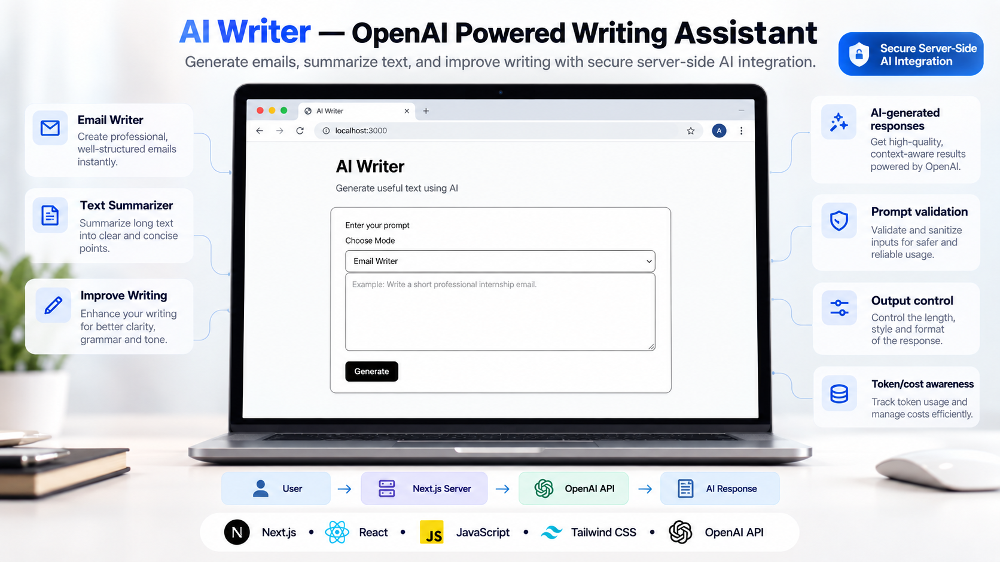

# AI Writer



AI Writer is an AI-powered writing assistant built with **Next.js** and the **OpenAI API**.

It allows users to generate professional emails, summarize text, and improve existing writing through a secure server-side AI integration.

---

## ✨ Features

- 📧 Email Writer
- 📝 Text Summarizer
- ✍️ Improve Writing
- 🤖 AI-generated responses
- 🔐 Secure server-side OpenAI API integration
- ✅ Prompt validation
- ⚡ Simple and fast user experience

---

## 🛠️ Tech Stack

- Next.js
- React
- JavaScript
- Tailwind CSS
- OpenAI API

---

## 🧠 How It Works

```text
User
  ↓
Next.js Server
  ↓
OpenAI API
  ↓
AI Response
```

The OpenAI API key is handled on the server side and is not exposed directly to the browser.

---

## 🎯 Available Modes

### 📧 Email Writer

Generate professional emails for situations such as:

- Internship applications
- Job applications
- Business communication
- Client communication
- Professional messages

### 📝 Summarize

Turn long text into shorter, clearer, and easier-to-read summaries.

### ✍️ Improve Writing

Improve existing text by enhancing:

- Grammar
- Clarity
- Tone
- Readability
- Overall writing quality

---

## 🔐 Secure AI Integration

AI Writer uses server-side OpenAI API integration.

The browser does not communicate directly with OpenAI using the API key.

Instead, the request follows this flow:

```text
Browser → Next.js Server → OpenAI API → Response
```

This helps keep sensitive API credentials private.

---

## ✅ Prompt Validation

Before sending a request to the OpenAI API, the application checks the user input.

This helps prevent:

- Empty prompts
- Invalid requests
- Unnecessary API calls

---

# 🚀 Run Locally

If you want to run or experiment with AI Writer on your own computer, follow these steps.

## 1. Clone the Repository

```bash
git clone https://github.com/AnupBhandari12/ai-writer.git
```

## 2. Open the Project

```bash
cd ai-writer
```

## 3. Install Dependencies

Using npm:

```bash
npm install
```

Or using Bun:

```bash
bun install
```

---

## 4. Create Environment Variables

Create a file named:

```text
.env.local
```

inside the root directory of the project.

Add your OpenAI API key:

```env
OPENAI_API_KEY=your_openai_api_key
```

You need your own OpenAI API key to use the AI features.

> ⚠️ Never upload or commit your real API key to GitHub.

Make sure `.gitignore` contains:

```gitignore
.env
.env.local
.env*.local
```

---

## 5. Start the Development Server

Using npm:

```bash
npm run dev
```

Or using Bun:

```bash
bun dev
```

Open your browser and visit:

```text
http://localhost:3000
```

---

# 💡 How to Use

1. Open AI Writer.
2. Choose an AI mode.
3. Enter your text or prompt.
4. Click **Generate**.
5. The request is sent to the Next.js server.
6. The server communicates with the OpenAI API.
7. The generated response is displayed in the application.

---

## Example

Select:

```text
Email Writer
```

Enter:

```text
Write a short professional internship email for a software development position.
```

Click:

```text
Generate
```

AI Writer will generate a professional email based on your request.

---

# 📁 Project Structure

```text
ai-writer/
│
├── app/
│   ├── actions.js
│   ├── page.js
│   ├── layout.js
│   └── globals.css
│
├── lib/
│
├── public/
│   └── ai-writer-showcase.png
│
├── .env.local
├── .gitignore
├── package.json
└── README.md
```

---

# 🌐 Deployment

AI Writer can be deployed easily using **Vercel**.

When deploying the project, add the following environment variable inside your Vercel project settings:

```env
OPENAI_API_KEY=your_openai_api_key
```

Never expose the API key inside frontend code.

---

# 🔮 Future Improvements

Some features that could be added in future versions:

- User authentication
- AI generation history
- Copy response button
- Download generated content
- Tone selection
- Response length controls
- Prompt templates
- Token usage tracking
- Cost tracking
- Usage analytics
- Multiple AI models
- Saved prompts
- Dark mode
- Improved mobile experience

---

# 🤝 Contributing / Using This Project

You are welcome to clone, fork, explore, and build on top of this project.

To create your own version:

1. Fork this repository.
2. Clone your fork.
3. Install the dependencies.
4. Add your own OpenAI API key.
5. Run the project locally.
6. Modify or extend the application.

If you build something interesting using AI Writer, feel free to share it.

---

# 👨‍💻 Author

**Anup Bhandari**

GitHub:

https://github.com/AnupBhandari12

---

# 📄 License

This project is licensed under the **MIT License**.

You are free to use, modify, and distribute this project according to the terms of the MIT License.

---

# ⭐ Support

If you find this project useful, consider giving the repository a **star ⭐**.